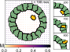

# Germ cell Transepithelial Migration
Codes and data related to the project on Germ cell TEM from members of Extavour lab at Harvard

The directory **insilico** contains the Compucell3D project directory and within it, it has all the codes to simulate our model of transepithelial migration.  
The directory **CodesForFigures** contains all the python codes used for making the figures along with the data.  

